# TETRA-SHIELD AI — Visual Showcase (every screen, explained to the core)

All screenshots captured live from the running application in **offline cache mode**
(no internet, headless Chromium, WebGL via SwiftShader — exactly what a judge sees).

---

## 1. Home — the 60-second orientation
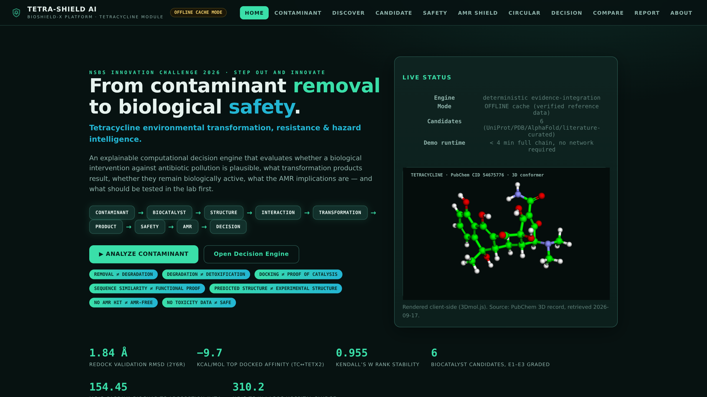
**What you see:** headline doctrine ("From contaminant removal to biological safety"),
the animated nine-stage intelligence pipeline, the **▶ ANALYZE CONTAMINANT** entry button,
the scientific-distinction chips, live engine status, and a real 3D tetracycline molecule
(PubChem CID 54675776, rendered client-side with 3Dmol.js from the fetched 3D SDF).
**Why it matters:** a judge understands the problem, the chain and the honesty contract
before touching anything. Stat row shows only computed numbers: redock RMSD 1.84 Å,
top affinity −9.7 kcal/mol, Kendall's W 0.955, 6 candidates, cassava adsorption 154.45 mg/g,
Lagos sludge 310.2 ng/g.

## 2. Contaminant Intelligence
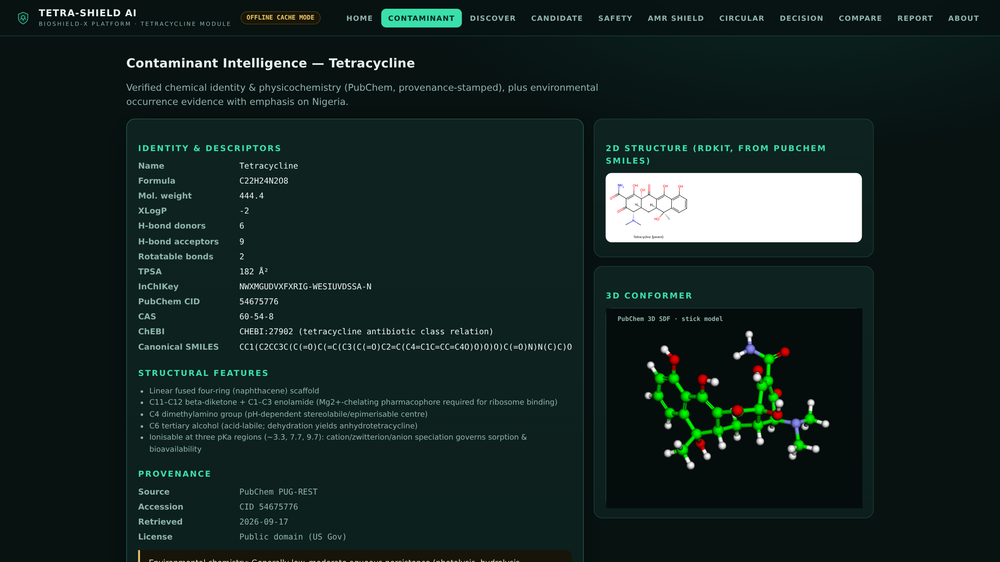
**What:** verified identity & descriptors (PubChem, provenance-stamped), structural-feature
notes (β-diketone chelator, epimerisable C4, acid-labile C6-OH), RDKit 2D depiction,
3D conformer, Nigerian occurrence table (per-record evidence class, no national
extrapolation), schematic Lagos map (labelled schematic), One-Health source/pathways.
**Why:** Module 1 & 2 — chemistry first, and "view evidence" provenance is one click deep.

## 3. Candidate Discovery
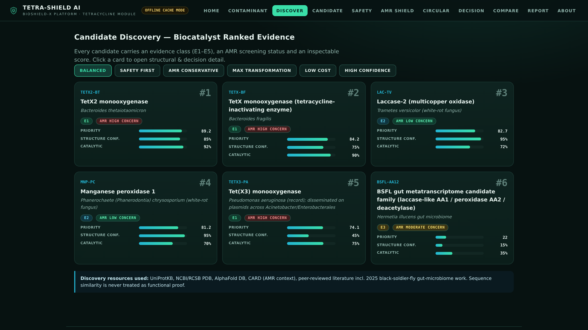
**What:** six ranked candidate cards — evidence chips (E1/E2/E3), AMR screening chips,
priority / structural-confidence / catalytic lanes; preset stances re-rank.
**Why:** discovery is not a list — it is ranked *evidence*, and the resistance-gene
candidates wear their AMR warning on the card itself.

## 4. Candidate Dossier — TetX2 (the flagship page)
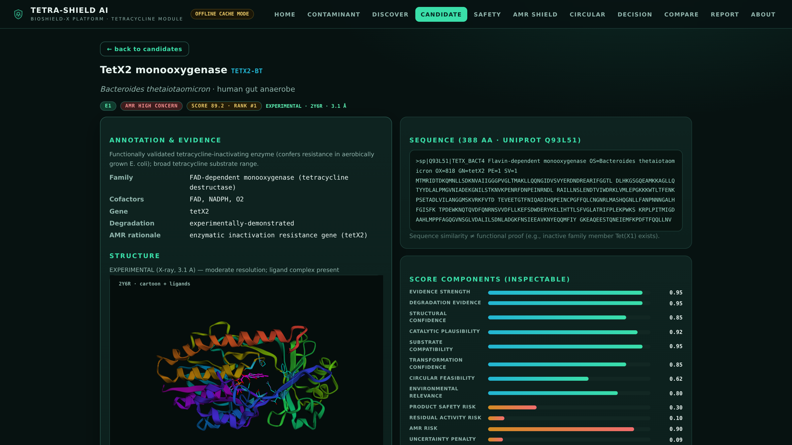
**What:** annotation & evidence (family, cofactors, degradation status, AMR rationale),
**experimental** structure badge (2Y6R, 3.1 Å — not called "predicted" or hidden),
3D viewer (spectrum cartoon; FAD magenta; docked tetracycline yellow; contact residues cyan),
UniProt FASTA sequence (Q93L51, 388 aa) with the *similarity ≠ function* caveat,
and all 13 inspectable score components with values.
**Why:** this is where a professor checks whether we are honest — and finds we are.

## 5. Candidate Dossier — Laccase (honest-negative case)
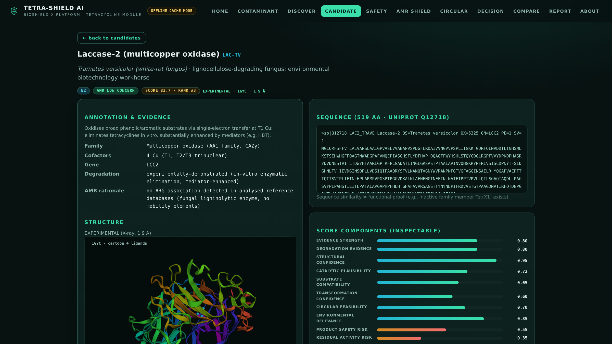
**What:** experimental 1GYC structure (four blue Cu spheres visible), E2 evidence,
LOW AMR concern — and the rigid-docking **negative result** documented in the page
(all poses ≈ 0 kcal/mol at the T1 Cu channel; docking absence ≠ proof of non-catalysis).
**Why:** systems that only show wins are not credible. Ours ships its failures.

## 6. Transformation & Product Safety
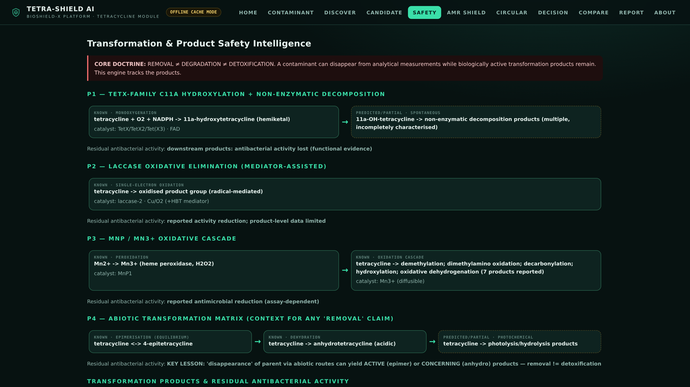
**What:** four pathways with KNOWN (solid) vs PREDICTED/PARTIAL (dashed) steps —
P1 TetX C11a hydroxylation → non-enzymatic decomposition; P2 laccase; P3 MnP/Mn³⁺;
P4 abiotic matrix (epimerisation, anhydrotetracycline, photolysis). Residual-activity
summary under each. Product cards (TP-11OH STRUCTURE UNCERTAIN; epimer RETAINS activity).
**Why:** the core innovation made visible: the engine tracks what the molecule *becomes*.

## 7. AMR SHIELD
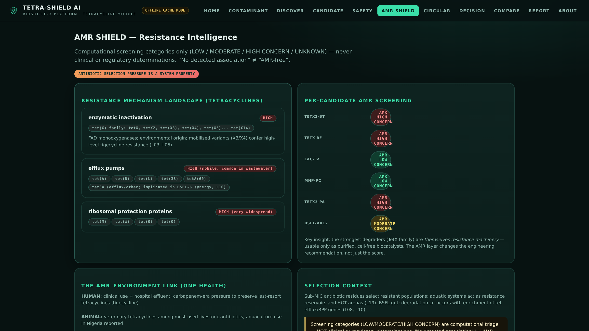
**What:** three resistance-mechanism classes (enzymatic inactivation, efflux, RPP) with
gene lists; per-candidate screening (LOW/MODERATE/HIGH/UNKNOWN — explicitly *not*
clinical determinations); One-Health Nigerian context.
**Why:** the biocatalyst with the best chemistry is itself resistance machinery — the
system says so and changes the deployment form (purified enzyme only).

## 8. Circular Bioremediation (Cassava)
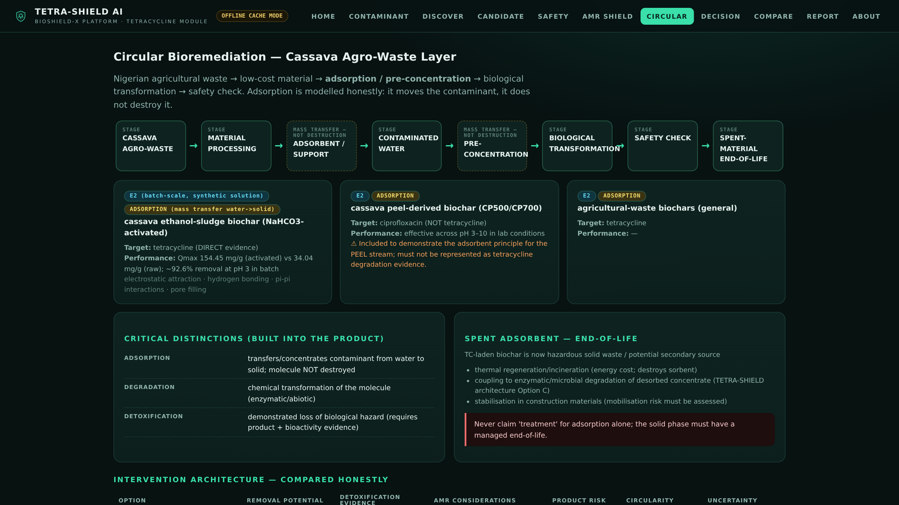
**What:** the eight-stage cassava flow chain with MASS-TRANSFER stages flagged;
evidence cards distinguishing sludge-biochar TC evidence from peel-biochar CFX-only
evidence; adsorption vs degradation vs detoxification panel; spent-adsorbent
end-of-life; intervention options A–D table.
**Why:** local circularity with zero contamination of the science by wishful thinking.

## 9. Decision Engine
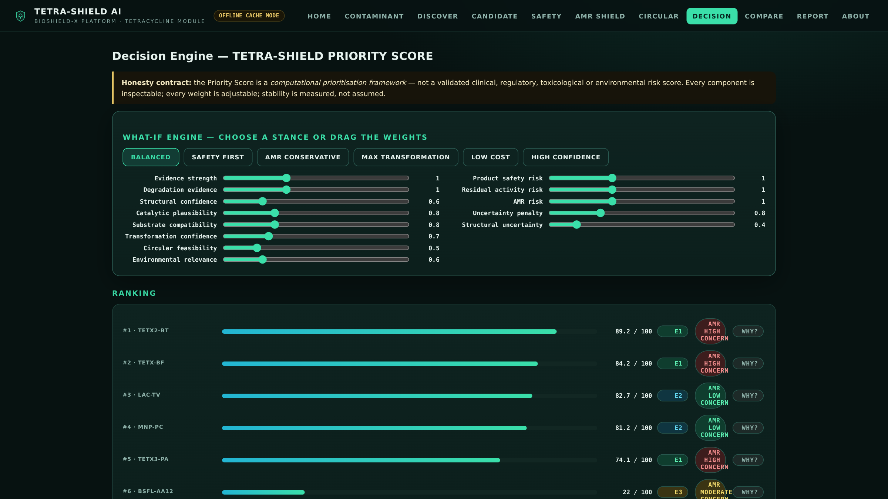
**What:** the honesty-contract banner; WHAT-IF preset stances + 13 custom weight sliders;
live ranking with E/AMR chips and WHY buttons; sensitivity (Kendall's W, per-candidate
rank stability), ablation and baseline panels.
**Why:** decision *support* — the judge steers, the engine shows consequences.

## 10. Candidate Comparison
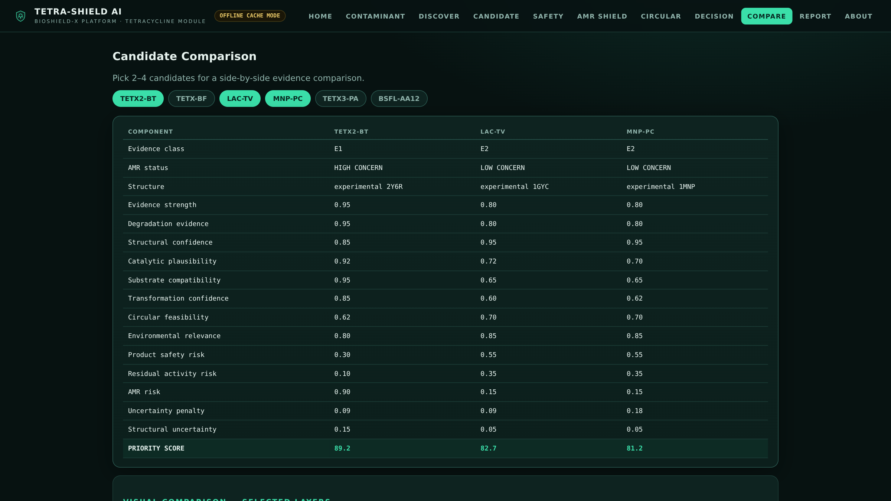
**What:** 2–4 candidates side-by-side across evidence class, structure, all 13 components
and score, plus a grouped-bar visual comparison.
**Why:** reviewers always ask "what's the trade-off between A and C?" — this answers in one screen.

## 11. Report Export
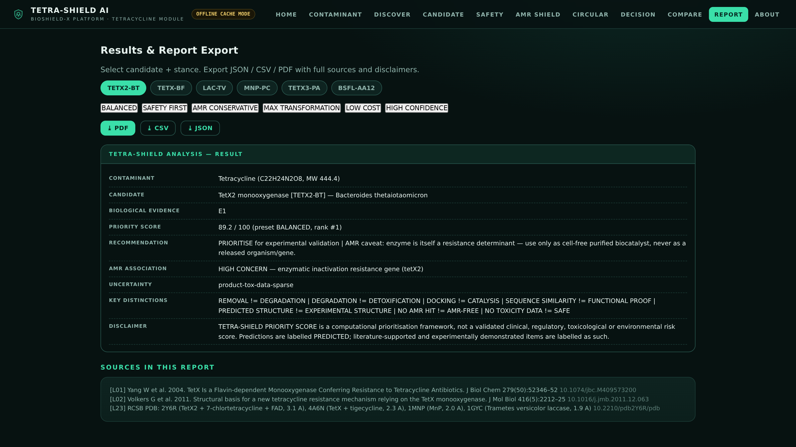
**What:** candidate + stance picker; PDF / CSV / JSON export; preview with verdict,
AMR rationale, uncertainty flags, disclaimers and scoped sources.
**Why:** every claim leaves the room with receipts.

## 12. About / Methods / Honesty contract
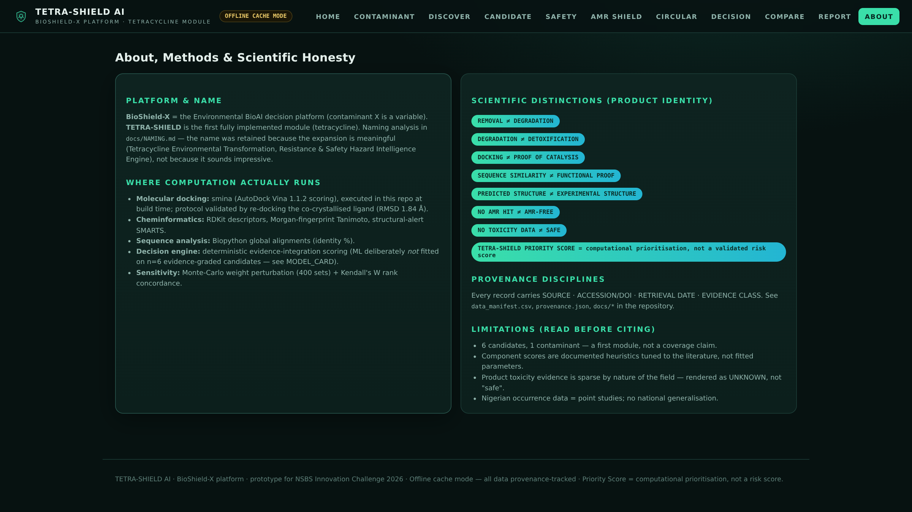
**What:** platform naming (BioShield-X), where computation actually runs (smina docking,
RDKit, Biopython, deterministic engine — no fitted ML on n=6), provenance disciplines,
limitations.
**Why:** the page that survives hostile questioning.

## 13. WHY? — explainability in one click
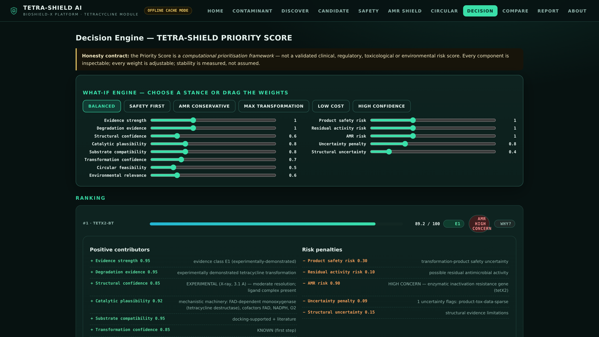
**What:** clicking WHY on any rank row expands positive contributors (green) vs risk
penalties (amber) with the textual basis of each — structure label, mechanism, residue
numbers — and the verdict line.
**Why:** no black box. The score is an explanation with a number, not a number with a story.

## 14. WHAT-IF: AMR-CONSERVATIVE stance flips the ranking

**What:** the same engine, one click: LAC-TV #1 (85.7), MNP-PC #2 (84.7), resistance-enzymes
demoted (#3–5). This recalculation is *the* signature interaction of the live demo.
**Why:** priorities depend on values; a serious engine must reveal that, not bake it in.

## 15. ANALYZE — mid-flight
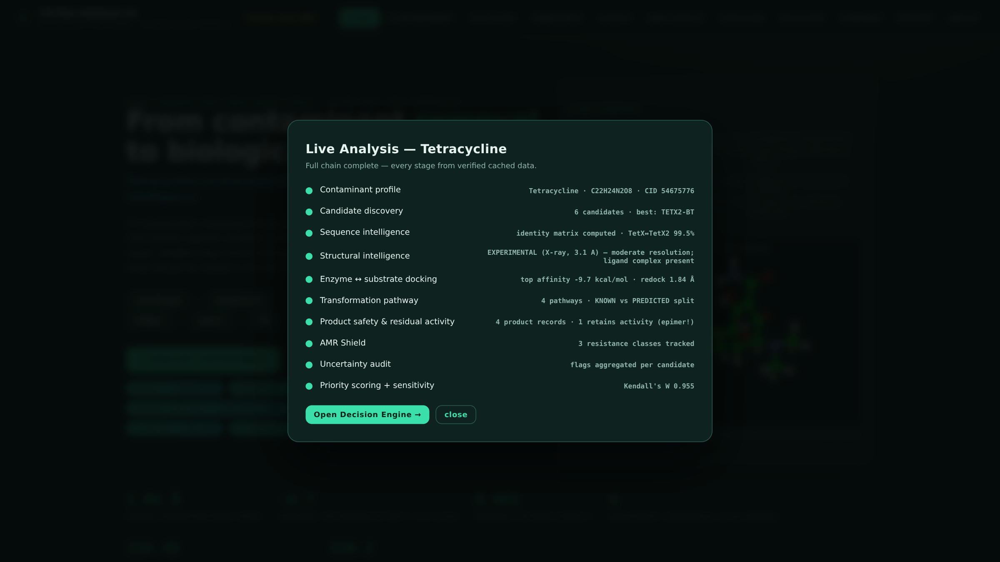
**What:** the live chain executing stage by stage, each line a real local API result.

## 16. ANALYZE — complete
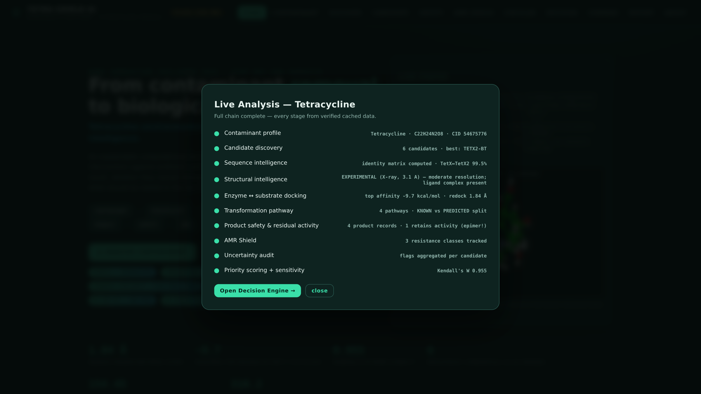
**What:** ten stages done with their computed facts (−9.7 kcal/mol, redock 1.84 Å,
identity 99.5%, 1 activity-retaining product, W 0.955), and the jump into the Decision Engine.
**Why:** the competition "magic moment" — contaminant to decision in under 15 seconds, offline.
